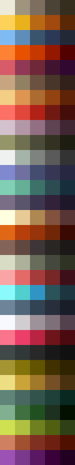
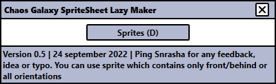
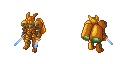
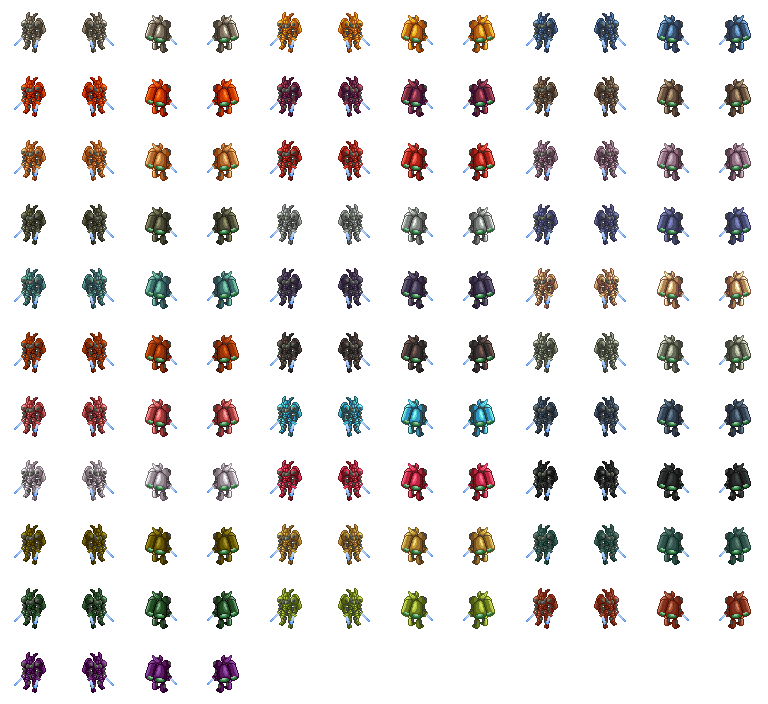

# Chaos Galaxy SpriteSheet Lazy Maker
Chaos Galaxy 2 is a game where the modding begin to be added. Pre-emptively, i have create this tool for help me.

Create all colors of your unit for the Chaos Galaxy Game.

Press Ctrl+D for create your spritesheet.

You need to use any lines of colors from this palette except the last one. They are the "31" factions of the game.

You can put only the front and the reverse back like the example below or the 4 frames.

Download link:
https://github.com/Snrasha/ChaosGalaxySpriteSheetLazyMaker/releases
Download the zip. Do not download the source code.
Unzip it and execute the executable.

## The software:

## Input:

## Output:

